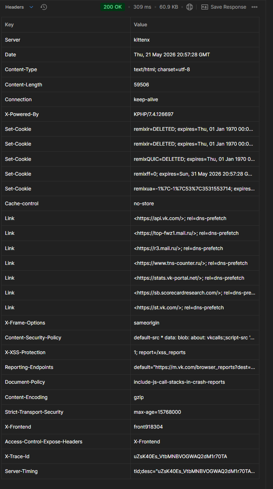

## Задание 1
cd 10

npm install pixi.js@7

npx serve .

## Задание 2
npm install axios

При запуске в браузере получаем ошибку в консоли:
> Запрос из постороннего источника заблокирован: Политика одного источника запрещает чтение удалённого ресурса на https://vk.com/. (Причина: отсутствует заголовок CORS «Access-Control-Allow-Origin»). Код состояния: 200.

Как можно заметить, блокируется из за отсутствия CORS заголовка Access-Control-Allow-Origin. CORS -- это система безопасности в браузере. Тут браузер запритил запросы в удаленный ресурс из за заголовка.

Сделал запрос через node: `node scripts/2.js`, получил статус 200, т.к. в node нет CORS и запрос не блокируется.
## Задание 3
Запрос на geoip успешно выполнился в обоих случаях, т.к. в сервер возвращает заголовок «Access-Control-Allow-Origin».
Запуск через node: `node scripts/2.js`

## Задание 4
Постман был скачан по ссылке https://www.postman.com/downloads/

## Задание 5
Были получены заголовки для get-запроса на vk.com. Как можно видеть, тут нет заголовка Access-Control-Allow-Origin, что подтверждает резульат, полученный во 2 задании.

Этот заголовок есть для geoiplookup, поэтому браузер не блокирует cross-origin заросы к нему.

## Задание 6
Зарегался на reqres.in, получил ключ, поместил его в заголовок x-api-key для аутентификации при запросе в апи. Сделал гет-запрос, взял первый email из data.

Зарегестрировал пользователя с этим email через post, в заголовки так же поместил ключ.

## Задание 7
Сделал логин для этого пользователя, в заголовки вставил свой ключ.

## Задание 8
Все исходники в директории task8
`cd task8`
`npm install vite --save-dev`

Имя local нельзя использовать для переменных среды, оно зарезервированно для постфикса.
>Error: "local" cannot be used as a mode name because it conflicts with the .local postfix for .env files.

Поэтому сам файл я назвал `.env.loc`. Однако, запустить его можно через:

`npm run local`
