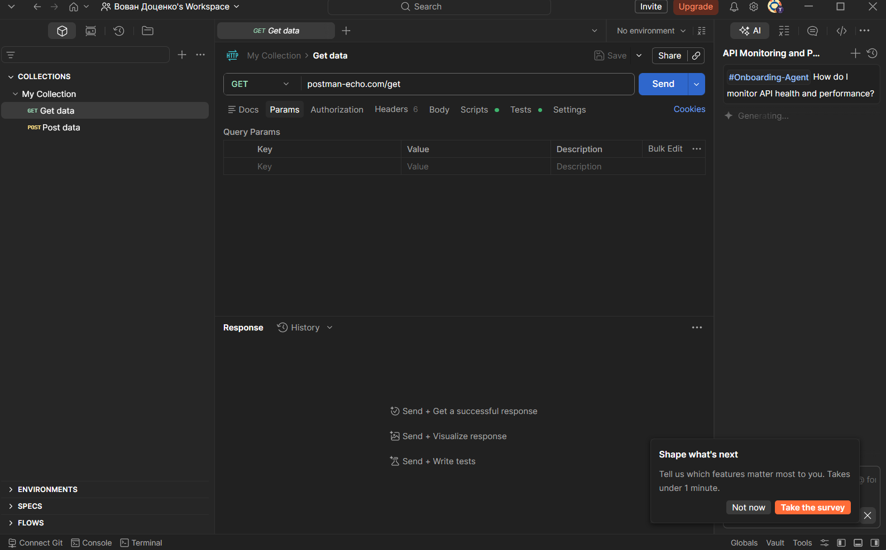
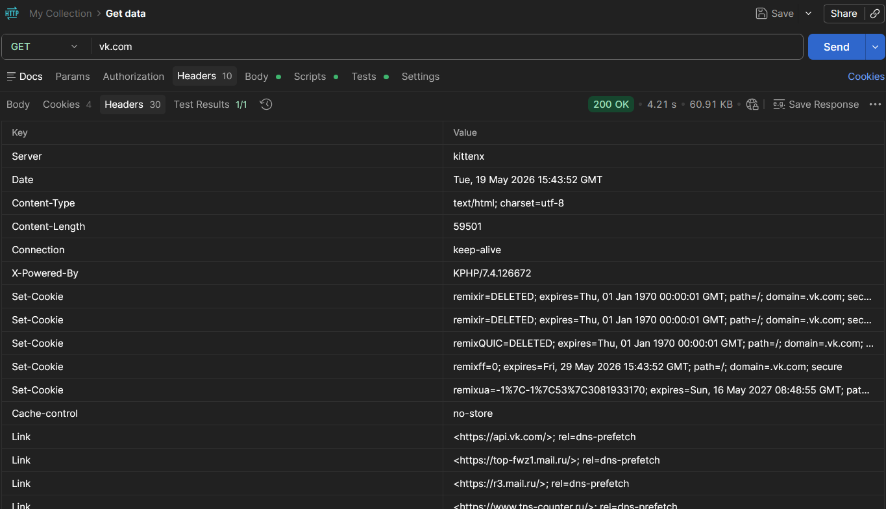
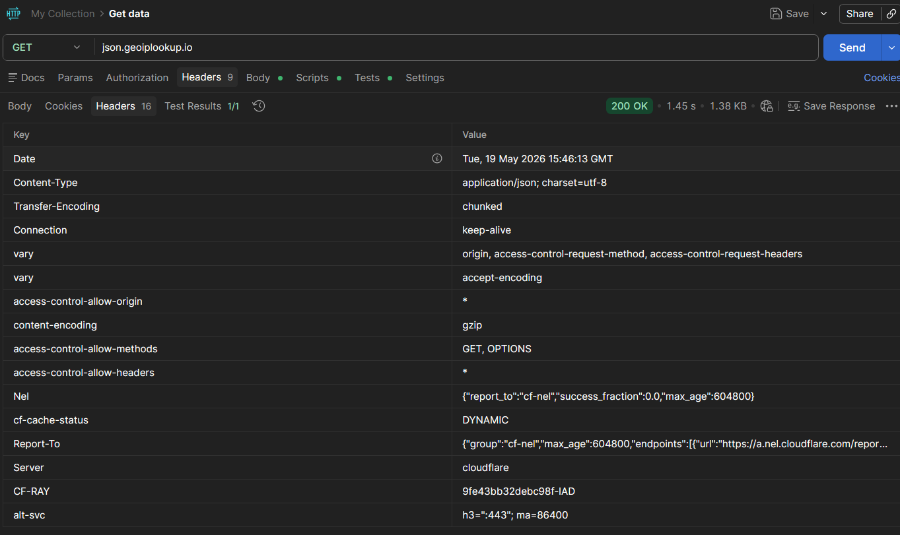
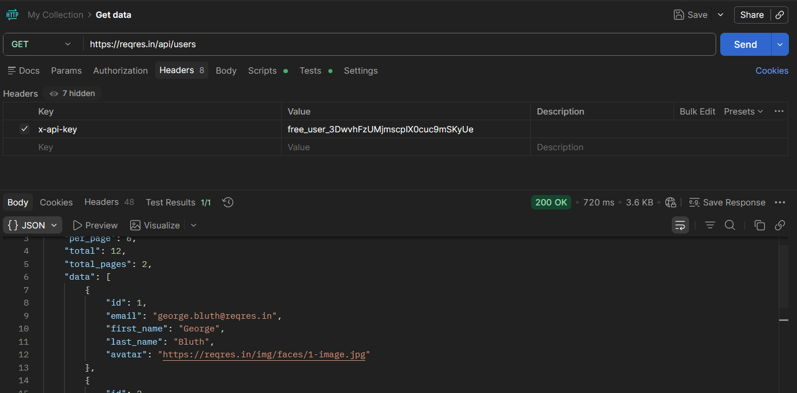
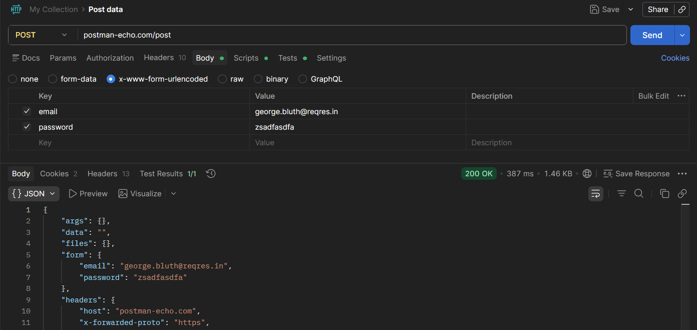
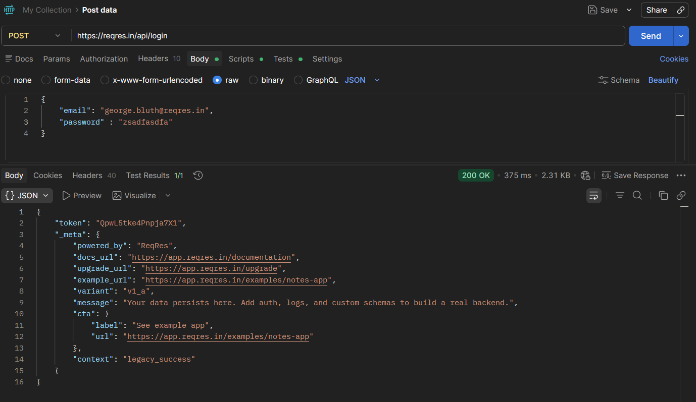

## Задание 1
cd 10

npm install pixi.js@7

npx serve .

## Задание 2
npm install axios

При запуске в браузере получаем ошибку в консоли:
> Запрос из постороннего источника заблокирован: Политика одного источника запрещает чтение удалённого ресурса на https://vk.com/. (Причина: отсутствует заголовок CORS «Access-Control-Allow-Origin»). Код состояния: 200.

Как можно заметить, блокируется из за отсутствия CORS заголовка Access-Control-Allow-Origin. CORS -- это система безопасности в браузере. Тут браузер запритил запросы в удаленный ресурс из за заголовка.

Сделал запрос через node: `node scripts/2.js`, получил статус 200, т.к. в node нет CORS и запрос не блокируется.
## Задание 3
Запрос на geoip успешно выполнился в обоих случаях, т.к. в сервер возвращает заголовок «Access-Control-Allow-Origin».
Запуск через node: `node scripts/2.js`

## Задание 4
Постман был скачан по ссылке https://www.postman.com/downloads/

## Задание 5

## Задание 6
зарегался на reqres.in, получил ключ

## Задание 7

## Задание 8
Все исходники в директории task8
cd task8
npm install vite --save-dev

Error: "local" cannot be used as a mode name because it conflicts with the .local postfix for .env files.

npm run local